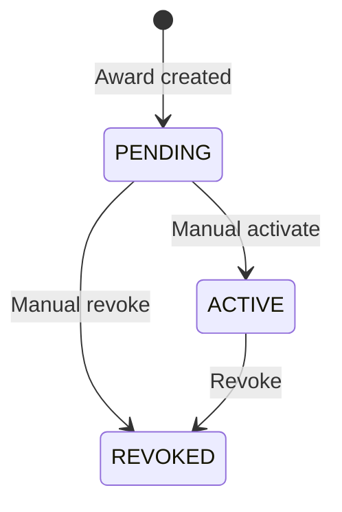
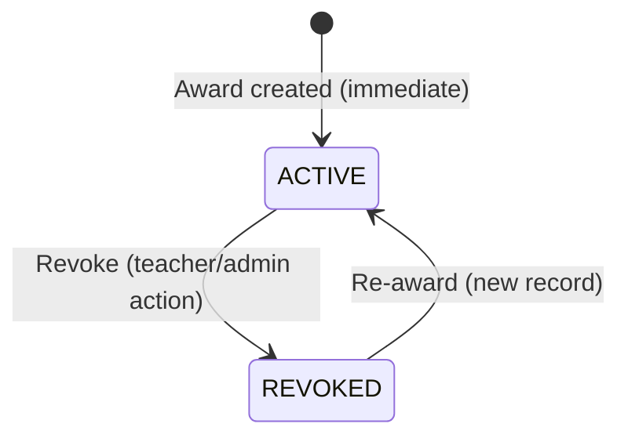

# Technical Specification: Auto Badge Activation

**Version:** 1.0  
**Author:** Product Owner / System Analyst  
**Date:** 2025-09-13  
**Branch:** FTalentHub  
**Related:** Badge Award System, Notification System, School/Teacher Credential Management

---

## 1. User Story

### US-001: Auto-activate badge upon award
> **As a** School Admin / Teacher  
> **I want** badges I award to students to become **Active immediately**  
> **So that** students see their achievements instantly without manual approval steps

### US-002: Real-time notification on auto-activation
> **As a** Student  
> **I want** to receive a **real-time notification** when a badge is activated on my profile  
> **So that** I am immediately aware of my new achievement

### US-003: Audit trail for auto-activation
> **As a** System Administrator  
> **I want** every auto-activation to be **logged with actor, timestamp, and context**  
> **So that** the system maintains full traceability for compliance and debugging

---

## 2. Acceptance Criteria (AC)

| ID | Scenario | Given | When | Then |
|----|----------|-------|------|------|
| **AC-01** | Teacher awards badge via UI | Teacher on `/app/teacher/credentials.php`, selects student + badge, clicks "Cấp badge" | POST `action=award_badge` | Badge status = `active` immediately; student sees it on `/app/learner/badges.php` |
| **AC-02** | School Admin awards badge via UI | School admin on `/app/school/credentials.php`, selects student + badge, clicks "Cấp badge" | POST `action=award_badge` | Badge status = `active` immediately |
| **AC-03** | Auto-award via project completion | Project status changes to `completed` | `SchoolDashboardService::autoAwardOnProjectComplete()` runs | Eligible badges status = `active` immediately |
| **AC-04** | Auto-award via learning time | Student heartbeat pushes total minutes ≥ threshold | `LearningTimeService::recordHeartbeat()` → `BadgeAwardService::evaluateAndAward()` | Eligible badges status = `active` immediately |
| **AC-05** | Notification published | Any badge becomes active | `NotificationService::publish()` called | Student receives `badge_awarded` notification with deep link |
| **AC-06** | Duplicate prevention | Same student + same badge already awarded | Any award flow runs | No duplicate record; existing award unchanged |
| **AC-07** | Revoked badge re-award | Badge previously revoked (`status=revoked`) | Same badge awarded again | New award record with `status=active`; history preserved |
| **AC-08** | Database error rollback | DB constraint violation or deadlock | Any award flow runs | Transaction rolled back; error logged; UI shows friendly message |

---

## 3. Data Flow Diagram

```mermaid
flowchart TD
    A[Actor: Teacher/School Admin/System] --> B{Action Type}
    B -->|Manual Award| C[POST /app/teacher/credentials.php or /app/school/credentials.php]
    B -->|Auto Project| D[Project status -> completed]
    B -->|Auto Learning| E[Heartbeat API -> LearningTimeService]
    
    C --> F[SchoolCredentialManagementService::awardBadgeToTarget()]
    D --> G[SchoolDashboardService::autoAwardOnProjectComplete()]
    E --> H[BadgeAwardService::evaluateAndAward()]
    
    F --> I[SchoolCredentialManagementRepository::awardBadge()]
    G --> I
    H --> I
    
    I --> J{Student already has badge?}
    J -->|Yes| K[Skip / Update existing]
    J -->|No| L[INSERT INTO student_badges]
    
    L --> M[student_badges: status=active, awardedBy=teacher|school_admin|system]
    M --> N[NotificationService::publish()]
    N --> O[notifications table: badge_awarded event]
    O --> P[Student sees badge on /app/learner/badges.php]
```

---

## 4. Badge Status State Machine

### Current (Before Change)


### New (Auto-Activation)


### `student_badges` Table — Relevant Columns

| Column | Type | Description | New Behavior |
|--------|------|-------------|--------------|
| `id` | CHAR(36) | PK | UUID v4 |
| `studentId` | CHAR(36) | FK → student_profiles | — |
| `badgeId` | CHAR(36) | FK → badges | — |
| `ruleDefinitionId` | CHAR(36) | FK → badge_rule_definitions | — |
| `awardedAt` | DATETIME(6) | Thời điểm cấp | `NOW()` at award time |
| `awardedBy` | VARCHAR(64) | `'teacher' \| 'school_admin' \| 'system'` | Set by actor |
| `awardContext` | JSON | Metadata: `{fact, current, target, evaluatedAt, ruleVersion, ruleDefinitionId, note?, source?}` | Auto-populated |
| **Status** | — | **Không còn cột `status`** (unique key prevents duplicates) | **Mặc định = Active** |

> **Note:** Bảng `student_badges` **không có cột `status`**. Trạng thái "active" được suy ra từ việc record tồn tại. `REVOKED` = record bị xóa hoặc có flag riêng (nếu cần audit, có thể thêm cột `revokedAt` trong migration sau).

---

## 5. Repository / Service Changes

### Files to Modify

| File | Change |
|------|--------|
| `src/Modules/School/Repository/SchoolCredentialManagementRepository.php` | `awardBadge()` → ensure `INSERT ... ON DUPLICATE KEY UPDATE` sets `awardedAt=NOW()`, `awardedBy=actor`, `awardContext=...`; return inserted/updated flag |
| `src/Modules/School/Service/SchoolCredentialManagementService.php` | `awardBadge()` → call repo, then `NotificationService::publish()` |
| `src/Modules/School/Service/SchoolDashboardService.php` | `autoAwardOnProjectComplete()` → use `BadgeAwardService` or repo directly; ensure notification |
| `app/learner/data/Service/BadgeAwardService.php` | `evaluateAndAward()` already auto-activates + notifies — **no change needed** |
| `app/learner/data/Service/NotificationService.php` | Ensure `publish()` supports `badge_awarded` event key deduplication |

### New: Notification Event Key Format
```php
$eventKey = "badge_award:{$studentId}:{$badgeId}:v{$ruleVersion}";
```
- Prevents duplicate notifications for same award
- Used in `NotificationService::publish()` to check existing

---

## 6. Edge Cases & Handling

| # | Edge Case | Detection | Handling |
|---|-----------|-----------|----------|
| **EC-01** | Duplicate award (same student + badge) | UNIQUE KEY `uq_student_badges_award (studentId, badgeId)` throws 1062 | `ON DUPLICATE KEY UPDATE` → refresh `awardedAt`, `awardContext`; **do not** create duplicate notification |
| **EC-02** | Revoked badge re-awarded | Previous record deleted or `revokedAt` set | Allow new INSERT (UNIQUE key allows if old deleted); or if soft-delete → UPDATE `revokedAt=NULL`, `awardedAt=NOW()` |
| **EC-03** | Concurrent awards (race condition) | Two requests award same badge simultaneously | DB transaction + `FOR UPDATE` on student row; second request hits duplicate key → handled by EC-01 |
| **EC-04** | Notification publish fails (queue down) | `NotificationService::publish()` throws | Log error; **do not rollback badge award** (badge is active); async retry via outbox table or scheduled job |
| **EC-05** | Actor not authorized | `PermissionService::require('school_credential.manage_own')` fails | Throw `ApiException(403)` before any DB write |
| **EC-06** | Invalid badge (not belong to school) | Repo checks `badge.schoolId = actorSchoolId` | Throw `ApiException(404, 'BADGE_NOT_FOUND')` |
| **EC-07** | Student not in actor's school | Repo checks `student.class.schoolId = actorSchoolId` | Throw `ApiException(403, 'STUDENT_NOT_IN_SCHOOL')` |
| **EC-08** | System auto-award during maintenance window | Cron/heartbeat runs while DB locked | Skip with warning log; next heartbeat re-evaluates |
| **EC-09** | Badge rule criteria changed after student qualified | Rule version incremented | Student re-evaluated on next `evaluateAndAward()`; new version awards if eligible |
| **EC-10** | Student deleted (GDPR) | `student_profiles` row deleted | CASCADE DELETE removes `student_badges` records |

---

## 7. Database Migration (if needed)

```sql
-- Optional: Add revokedAt for soft-delete audit trail
ALTER TABLE student_badges 
ADD COLUMN revokedAt DATETIME(6) NULL AFTER awardedAt,
ADD INDEX idx_student_badges_revoked (studentId, revokedAt);
```

---

## 8. Testing Checklist

| Test Case | Expected |
|-----------|----------|
| Teacher awards badge → student sees it instantly | ✅ Badge visible on `/app/learner/badges.php` with green ring |
| School admin awards badge → notification sent | ✅ Toast + notification bell shows "Chúc mừng! Bạn đã đạt huy hiệu..." |
| Project completed → auto badge | ✅ `autoAwardOnProjectComplete()` creates award + notification |
| Learning time threshold met → auto badge | ✅ Heartbeat triggers evaluation → award + notification |
| Award same badge twice | ✅ No duplicate; no duplicate notification |
| Revoke then re-award | ✅ New award record; history preserved |
| Network error during notification | ✅ Badge still active; error logged; retry later |

---

## 9. Rollout Plan

1. **Deploy migration** (if adding `revokedAt`)
2. **Deploy code changes** (repo + service + notification)
3. **Smoke test** on staging: manual award + auto award
4. **Feature flag** (optional): `AUTO_BADGE_ACTIVATION=true` → gradually enable
5. **Monitor** notification queue lag, duplicate notification rate
6. **Rollback plan**: revert code; migration is additive (no data loss)

---

## 10. References

- `BadgeRuleEngine.php` — threshold evaluation logic
- `BadgeAwardService.php` — auto-award + notification flow
- `SchoolCredentialManagementService.php` — manual award entry point
- `SchoolDashboardService.php` — project completion auto-award
- `LearningTimeService.php` — heartbeat → auto-award
- `Database/Talenthub.sql` — `student_badges`, `badge_rule_definitions`, `notifications` schema