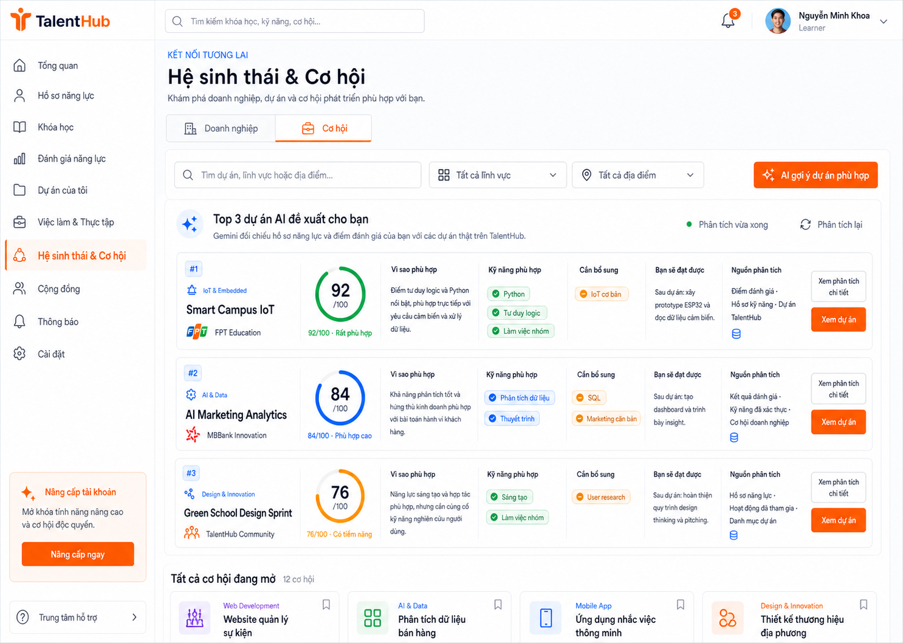

# Learner AI Opportunity Matching Implementation Plan

> **For agentic workers:** REQUIRED SUB-SKILL: Use superpowers:subagent-driven-development (recommended) or superpowers:executing-plans to implement this plan task-by-task. Steps use checkbox (`- [ ]`) syntax for tracking.

**Goal:** Add an inline learner-only Gemini feature to the `Cơ hội` tab that ranks canonical database projects/opportunities and displays an evidence-backed Top 3 with a 70% structured score and 30% Gemini score.

**Architecture:** Reuse the existing learner consent, snapshot, Gemini transport, recommendation run, evidence, rate-limit and audit infrastructure. Add a focused opportunity-matching domain that hard-filters canonical candidates, computes a deterministic score, sends at most 10 allow-listed candidates to Gemini, validates exactly Top 3 distinct analyses, persists the component/final scores, and renders them above the ordinary opportunity catalog.

**Tech Stack:** PHP 8+, PDO with MySQL/SQLite-compatible forward migrations, vanilla JavaScript, Node test runner, existing TalentHub CSS/design tokens, existing direct Gemini provider; no new dependencies.

## Execution Boundary

This document and its mockup are planning artifacts only. Creating or approving this plan does not authorize implementation. Do not create migrations, PHP classes, endpoints, JavaScript, CSS or tests until the user explicitly requests plan execution in a later step.

## Global Constraints

- Scope is learner portal only: students and learners viewing `app/learner/ecosystem.php`.
- Keep exactly two ecosystem tabs: `Doanh nghiệp` and `Cơ hội`; do not add an AI tab, modal, drawer, dashboard block or separate AI page.
- Demo result is exactly Top 3 when at least three valid candidates exist; when fewer exist, return only the valid candidates and state `catalog_insufficient`.
- Final score is `round(0.70 * structured_score + 0.30 * gemini_score)` with every score bounded to `0..100`.
- Hard-gate closed, expired, full, already-applied, foreign-tenant, ineligible education-band and protected-trait candidates before scoring.
- Send at most 10 canonical candidates to Gemini.
- Gemini may only select supplied `catalog_id` values and supplied skill/outcome codes; titles, providers, URLs, deadlines and availability always come from database evidence.
- Every Top 3 item must have a project-specific `why_fit`, matched skills, missing skills, expected outcomes and evidence references; reject duplicate or near-duplicate analyses.
- The score is a personal fit reference, never a learner ranking or a promise of hiring, admission, winning or employment.
- Never send email, phone, precise address, health data or protected traits to Gemini.
- Require learner auth, consent, CSRF, idempotency key and existing persistent rate limiting for generation.
- Preserve the last-known-good result when Gemini is temporarily unavailable, but remove recommendations whose canonical candidate has closed or expired.
- Render all model-derived strings with `textContent`; never use `innerHTML` for API/model content.
- Use `Be Vietnam Pro` and the approved tokens: primary `#F97316`, primary hover `#EA580C`, primary light `#FFF7ED`, secondary `#2563EB`, secondary light `#EFF6FF`, accent/success `#16A34A`, background `#F8FAFC`, surface `#FFFFFF`, text `#0F172A`/`#64748B`, border `#E2E8F0`, warning `#F59E0B`, danger `#DC2626`, radii `8px`/`12px`.
- Do not modify the existing roadmap page or its runtime bundles.
- Preserve unrelated working-tree changes, especially `app/learner/ai/Model/PromptRegistry.php`, `assets/js/learner-recommendations.js`, and `tests/learner_ai_recommendation_ui_test.js`.

## Approved Mockup



Workspace asset: `docs/superpowers/plans/assets/learner-ai-opportunity-matching-mockup.png`

Design source: `docs/superpowers/specs/2026-08-29-learner-ai-opportunity-matching-design.md`

## File Structure

### Create

- `Database/migrations/learner/015_extend_learner_opportunity_matching.php` — portable schema extension for catalog requirements and persisted match analyses.
- `Database/migrations/20260829000100_bridge_learner_opportunity_matching.php` — deployment-chain bridge for learner migration 015.
- `app/learner/ai/Matching/OpportunityCandidate.php` — validated canonical candidate value object.
- `app/learner/ai/Matching/LearnerOpportunityProfile.php` — consent-safe matching profile value object.
- `app/learner/ai/Matching/OpportunityScore.php` — immutable structured/Gemini/final score breakdown.
- `app/learner/ai/Matching/StructuredOpportunityScorer.php` — deterministic 35/25/15/15/10 scoring.
- `app/learner/ai/Matching/OpportunityMatch.php` — validated result item displayed to the learner.
- `app/learner/ai/Matching/OpportunityMatchValidator.php` — allow-list, evidence, uniqueness and safety validation.
- `app/learner/ai/Model/OpportunityMatchPromptRegistry.php` — Gemini prompt/schema dedicated to Top 3 opportunity matching.
- `app/learner/ai/Model/ModelOpportunityMatchEngine.php` — provider call and strict output mapping.
- `app/learner/ai/Persistence/OpportunityMatchRepository.php` — persistence boundary.
- `app/learner/ai/Persistence/DatabaseOpportunityMatchRepository.php` — run/item/evidence persistence and latest-valid lookup.
- `app/learner/ai/Service/OpportunityMatchService.php` — consent, snapshot, candidate, scoring, model, stale and persistence orchestration.
- `app/learner/api/v1/opportunity-matches.php` — GET latest and POST generate endpoint.
- `assets/js/learner-opportunity-matches.js` — isolated controller/view for inline ecosystem AI results.
- `tests/learner_ai_opportunity_matching_migration_test.php` — MySQL/SQLite migration contract.
- `tests/learner_ai_opportunity_candidate_test.php` — profile/candidate normalization and hard-gate coverage.
- `tests/learner_ai_opportunity_scorer_test.php` — deterministic weights and 70/30 composition.
- `tests/learner_ai_opportunity_provider_test.php` — Gemini request/schema/output validation.
- `tests/learner_ai_opportunity_service_test.php` — orchestration, stale and persistence behavior.
- `tests/learner_ai_opportunity_api_test.php` — auth/CSRF/idempotency/rate-limit response contract.
- `tests/learner_ai_opportunity_ui_test.js` — DOM-independent controller and static render contract.
- `tests/learner_ai_opportunity_end_to_end_test.php` — SQLite end-to-end Top 3 evidence test.

### Modify

- `app/learner/ai/Sources/Database/DatabaseCatalogSource.php` — expose canonical requirements, outcomes, provider, location, difficulty and education bands.
- `app/learner/ai/Sources/Database/DatabaseOpportunitySource.php` — expose internship `skillsJson`, `requirementsJson`, education level, description, benefits and enterprise name.
- `app/learner/ai/bootstrap.php` — require the focused matching classes.
- `app/learner/api/LearnerApiContext.php` — construct `OpportunityMatchService` with existing consent/snapshot/provider infrastructure.
- `app/learner/ecosystem.php` — add inline AI trigger/states/results before the regular opportunity grid and version the new JS asset.
- `assets/css/learner.css` — implement approved desktop/mobile layout and state styling.
- `tests/learner_ai_database_schema_test.php` — require new columns/indexes.
- `tests/learner_ecosystem_ui_test.js` — lock two-tab behavior and inline placement.

---

### Task 1: Add portable persistence and catalog schema

**Files:**
- Create: `Database/migrations/learner/015_extend_learner_opportunity_matching.php`
- Create: `Database/migrations/20260829000100_bridge_learner_opportunity_matching.php`
- Create: `tests/learner_ai_opportunity_matching_migration_test.php`
- Modify: `tests/learner_ai_database_schema_test.php`

**Interfaces:**
- Consumes: existing `ForwardMigrationDefinition`, `LearnerForwardMigration`, learner migration bridge and tables `learner_ai_catalog_items`, `learner_recommendation_runs`, `learner_recommendation_items`.
- Produces: catalog columns `provider_name`, `location`, `difficulty`, `required_skills_json`, `learning_outcomes_json`, `education_bands_json`; run column `capability`; item columns `catalogId`, `rankPosition`, `structuredScore`, `geminiScore`, `matchScore`, `analysisJson`; index `idx_learner_recommendation_runs_student_capability_created`.

- [ ] **Step 1: Write the failing portable migration contract test**

Create an in-memory SQLite fixture with the three existing tables, load migration 015, execute its statements, and assert exact columns and JSON checks:

```php
<?php
declare(strict_types=1);

require_once dirname(__DIR__) . '/bin/bootstrap.php';

$pdo = new PDO('sqlite::memory:');
$pdo->setAttribute(PDO::ATTR_ERRMODE, PDO::ERRMODE_EXCEPTION);
$pdo->exec('CREATE TABLE learner_ai_catalog_items (catalog_id TEXT PRIMARY KEY, item_type TEXT, category TEXT, title TEXT, summary TEXT, publish_status TEXT, deadline_at TEXT, eligibility_json TEXT, capacity INTEGER, enrolled_count INTEGER, url TEXT, action_json TEXT, school_id TEXT, tenant_id TEXT, updated_at TEXT)');
$pdo->exec('CREATE TABLE learner_recommendation_runs (id TEXT PRIMARY KEY, studentId TEXT, snapshotId TEXT, idempotencyKey TEXT, engineType TEXT, status TEXT, ruleVersion TEXT, provider TEXT, modelVersion TEXT, promptVersion TEXT, fallbackReason TEXT, safeErrorCode TEXT, startedAt TEXT, completedAt TEXT, createdAt TEXT)');
$pdo->exec('CREATE TABLE learner_recommendation_items (id TEXT PRIMARY KEY, runId TEXT, itemType TEXT, title TEXT, summary TEXT, priority INTEGER, confidenceBand TEXT, actionJson TEXT, lifecycleStatus TEXT, createdAt TEXT)');

$definition = require dirname(__DIR__) . '/Database/migrations/learner/015_extend_learner_opportunity_matching.php';
foreach ($definition->migration->statements('sqlite') as $sql) {
    $pdo->exec($sql);
}

$columns = static function (PDO $pdo, string $table): array {
    return array_column($pdo->query("PRAGMA table_info({$table})")->fetchAll(PDO::FETCH_ASSOC), 'name');
};

foreach (['provider_name','location','difficulty','required_skills_json','learning_outcomes_json','education_bands_json'] as $column) {
    assert(in_array($column, $columns($pdo, 'learner_ai_catalog_items'), true));
}
assert(in_array('capability', $columns($pdo, 'learner_recommendation_runs'), true));
foreach (['catalogId','rankPosition','structuredScore','geminiScore','matchScore','analysisJson'] as $column) {
    assert(in_array($column, $columns($pdo, 'learner_recommendation_items'), true));
}
echo "learner_ai_opportunity_matching_migration_test: OK\n";
```

- [ ] **Step 2: Run the migration test to verify it fails**

Run: `php tests/learner_ai_opportunity_matching_migration_test.php`

Expected: FAIL because `015_extend_learner_opportunity_matching.php` does not exist.

- [ ] **Step 3: Implement migration 015 and the deployment bridge**

Use driver-specific `ALTER TABLE` statements. The migration must provide these defaults so existing rows remain readable:

```php
return new ForwardMigrationDefinition(
    '015_extend_learner_opportunity_matching',
    'Extend learner catalog and recommendation rows for opportunity matching',
    __FILE__,
    hash_file('sha256', __FILE__),
    new class implements LearnerForwardMigration {
        public function version(): string { return '015_extend_learner_opportunity_matching'; }
        public function description(): string { return 'Extend learner catalog and recommendation rows for opportunity matching'; }
        public function statements(string $driver): array {
            $jsonType = strtolower($driver) === 'mysql' ? 'LONGTEXT' : 'TEXT';
            return [
                "ALTER TABLE learner_ai_catalog_items ADD COLUMN provider_name VARCHAR(255) NOT NULL DEFAULT ''",
                "ALTER TABLE learner_ai_catalog_items ADD COLUMN location VARCHAR(255) NOT NULL DEFAULT ''",
                "ALTER TABLE learner_ai_catalog_items ADD COLUMN difficulty VARCHAR(32) NOT NULL DEFAULT 'introductory'",
                "ALTER TABLE learner_ai_catalog_items ADD COLUMN required_skills_json {$jsonType} NULL",
                "ALTER TABLE learner_ai_catalog_items ADD COLUMN learning_outcomes_json {$jsonType} NULL",
                "ALTER TABLE learner_ai_catalog_items ADD COLUMN education_bands_json {$jsonType} NULL",
                "ALTER TABLE learner_recommendation_runs ADD COLUMN capability VARCHAR(50) NOT NULL DEFAULT 'recommendation'",
                "ALTER TABLE learner_recommendation_items ADD COLUMN catalogId VARCHAR(128) NULL",
                "ALTER TABLE learner_recommendation_items ADD COLUMN rankPosition INTEGER NULL",
                "ALTER TABLE learner_recommendation_items ADD COLUMN structuredScore INTEGER NULL",
                "ALTER TABLE learner_recommendation_items ADD COLUMN geminiScore INTEGER NULL",
                "ALTER TABLE learner_recommendation_items ADD COLUMN matchScore INTEGER NULL",
                "ALTER TABLE learner_recommendation_items ADD COLUMN analysisJson {$jsonType} NULL",
                'CREATE INDEX idx_learner_recommendation_runs_student_capability_created ON learner_recommendation_runs (studentId, capability, createdAt)',
            ];
        }
        public function expectedSchema(): array {
            return [
                'learner_ai_catalog_items' => ['columns' => ['provider_name','location','difficulty','required_skills_json','learning_outcomes_json','education_bands_json'], 'indexes' => []],
                'learner_recommendation_runs' => ['columns' => ['capability'], 'indexes' => ['idx_learner_recommendation_runs_student_capability_created']],
                'learner_recommendation_items' => ['columns' => ['catalogId','rankPosition','structuredScore','geminiScore','matchScore','analysisJson'], 'indexes' => []],
            ];
        }
    },
);
```

The bridge must call `LearnerMigrationBridge::migrate($context->pdo(), '015_extend_learner_opportunity_matching')` and be irreversible like migrations 011–014.

- [ ] **Step 4: Extend the canonical schema assertions**

Add the new columns/index to `tests/learner_ai_database_schema_test.php`. Do not require a new table.

- [ ] **Step 5: Run migration and schema tests**

Run:

```powershell
php tests/learner_ai_opportunity_matching_migration_test.php
php tests/learner_ai_database_schema_test.php
```

Expected: portable migration test PASS. The live schema test either PASS on a migrated database or report only the explicit unapplied migration-015 gap.

- [ ] **Step 6: Commit Task 1**

```powershell
git add Database/migrations/learner/015_extend_learner_opportunity_matching.php Database/migrations/20260829000100_bridge_learner_opportunity_matching.php tests/learner_ai_opportunity_matching_migration_test.php tests/learner_ai_database_schema_test.php
git commit -m "feat(ai): add learner opportunity match schema"
```

---

### Task 2: Normalize consent-safe learner profiles and canonical candidates

**Files:**
- Create: `app/learner/ai/Matching/OpportunityCandidate.php`
- Create: `app/learner/ai/Matching/LearnerOpportunityProfile.php`
- Create: `tests/learner_ai_opportunity_candidate_test.php`
- Modify: `app/learner/ai/Sources/Database/DatabaseCatalogSource.php`
- Modify: `app/learner/ai/Sources/Database/DatabaseOpportunitySource.php`
- Modify: `app/learner/ai/bootstrap.php`

**Interfaces:**
- Consumes: `RecommendationInput::payload()`, `RecommendationInput::evidenceReferences()`, `DatabaseCatalogSource::readForStudent()`, `DatabaseOpportunitySource::forStudent()`.
- Produces: `OpportunityCandidate::fromEvidence(array $evidence): self`, `LearnerOpportunityProfile::fromInput(RecommendationInput $input): self`, getters returning canonical skill codes/scores, assessment dimensions, education band and evidence references.

- [ ] **Step 1: Write failing candidate/profile tests**

The fixture must include one active internship, one expired project, one protected-trait catalog row, verified/unverified skills and an education band:

```php
$profile = LearnerOpportunityProfile::fromInput(candidate_test_input([
    'education_band' => 'high',
    'skills' => [
        ['code' => 'python', 'score' => 82, 'verification_status' => 'verified'],
        ['code' => 'sql', 'score' => 35, 'verification_status' => 'active'],
    ],
]));
assert($profile->educationBand() === 'high');
assert($profile->skillScore('python') === 82);
assert($profile->skillScore('email') === null);

$candidate = OpportunityCandidate::fromEvidence([
    'source_type' => 'opportunity',
    'source_id' => 'internship-1',
    'safe_value' => [
        'catalog_id' => 'internship-1',
        'item_type' => 'internship',
        'title' => 'Data Internship',
        'provider_name' => 'Verified Enterprise',
        'required_skills' => [['code' => 'python', 'minimum_score' => 60], ['code' => 'sql', 'minimum_score' => 50]],
        'learning_outcomes' => [['code' => 'dashboard', 'label' => 'Dashboard dữ liệu']],
        'education_bands' => ['high','college'],
        'deadline_at' => '2026-10-01T00:00:00.000000+00:00',
        'availability' => ['remaining' => 2],
        'status' => 'active',
        'url' => '/app/learner/ecosystem.php?tab=opportunities&focus=internship-1',
    ],
]);
assert($candidate->catalogId() === 'internship-1');
assert($candidate->isEligibleFor($profile, new DateTimeImmutable('2026-08-29T00:00:00Z')));
```

Also assert constructors reject unsafe URLs, protected-trait keys, unknown education bands, empty titles, duplicate skill codes and invalid scores.

- [ ] **Step 2: Run the candidate test to verify it fails**

Run: `php tests/learner_ai_opportunity_candidate_test.php`

Expected: FAIL because the matching value objects do not exist.

- [ ] **Step 3: Implement the profile and candidate value objects**

Use the exact public surface:

```php
final class LearnerOpportunityProfile
{
    public static function fromInput(RecommendationInput $input): self;
    public function educationBand(): ?string;
    public function skillScore(string $code): ?int;
    /** @return array<string,int> */ public function skills(): array;
    /** @return array<string,float> */ public function assessmentDimensions(): array;
    /** @return list<string> */ public function experienceTags(): array;
    /** @return list<string> */ public function evidenceRefs(): array;
}

final class OpportunityCandidate
{
    public static function fromEvidence(array $evidence): self;
    public function catalogId(): string;
    public function catalogType(): string;
    public function title(): string;
    public function providerName(): string;
    public function canonicalUrl(): string;
    /** @return list<array{code:string,minimum_score:int,label:string}> */ public function requiredSkills(): array;
    /** @return list<array{code:string,label:string}> */ public function learningOutcomes(): array;
    public function isEligibleFor(LearnerOpportunityProfile $profile, DateTimeImmutable $now): bool;
    /** @return array<string,mixed> */ public function providerPayload(): array;
}
```

Normalize codes with lowercase ASCII snake-case; keep labels only for display. Accept only internal single-slash URLs and verified `https://` external URLs.

- [ ] **Step 4: Extend the database sources with real canonical fields**

`DatabaseCatalogSource::allowedFields()` must include:

```php
[
    'action','availability','catalog_id','category','deadline_at','difficulty',
    'education_bands','eligibility','item_type','learning_outcomes','location',
    'provider_name','publish_status','required_skills','summary','title','updated_at','url',
]
```

`DatabaseOpportunitySource` must select and safely decode existing internship columns `description`, `benefits`, `educationLevel`, `skillsJson`, `requirementsJson` and enterprise `name`. Convert `skillsJson` into canonical required-skill records and map education levels to `middle`, `high`, `college`. Never pass raw requirement prose as a skill code.

- [ ] **Step 5: Register new classes in the learner AI bootstrap**

Add explicit `require_once` entries for the two value objects. Keep existing class order deterministic.

- [ ] **Step 6: Run candidate and existing source tests**

Run:

```powershell
php tests/learner_ai_opportunity_candidate_test.php
php tests/learner_ai_provider_test.php
php tests/learner_ecosystem_data_test.php
```

Expected: all PASS; existing ecosystem source scoping remains unchanged.

- [ ] **Step 7: Commit Task 2**

```powershell
git add app/learner/ai/Matching/OpportunityCandidate.php app/learner/ai/Matching/LearnerOpportunityProfile.php app/learner/ai/Sources/Database/DatabaseCatalogSource.php app/learner/ai/Sources/Database/DatabaseOpportunitySource.php app/learner/ai/bootstrap.php tests/learner_ai_opportunity_candidate_test.php
git commit -m "feat(ai): normalize learner opportunity candidates"
```

---

### Task 3: Implement deterministic scoring and the 70/30 composer

**Files:**
- Create: `app/learner/ai/Matching/OpportunityScore.php`
- Create: `app/learner/ai/Matching/StructuredOpportunityScorer.php`
- Create: `tests/learner_ai_opportunity_scorer_test.php`
- Modify: `app/learner/ai/bootstrap.php`

**Interfaces:**
- Consumes: `LearnerOpportunityProfile`, `OpportunityCandidate`.
- Produces: `StructuredOpportunityScorer::score(LearnerOpportunityProfile $profile, OpportunityCandidate $candidate): OpportunityScore`; `OpportunityScore::withGeminiScore(int $score): self`; `OpportunityScore::finalScore(): int`; `OpportunityScore::breakdown(): array`.

- [ ] **Step 1: Write failing exact-weight tests**

Cover all five dimensions and exact composition:

```php
$structured = new OpportunityScore([
    'skill_match' => 30,
    'assessment_alignment' => 20,
    'experience_relevance' => 10,
    'growth_potential' => 12,
    'feasibility' => 8,
]);
assert($structured->structuredScore() === 80);
assert($structured->withGeminiScore(90)->finalScore() === 83); // round(56 + 27)
assert($structured->withGeminiScore(0)->finalScore() === 56);
```

Add cases for exact skill threshold, a manageable missing skill, a missing mandatory skill, zero assessment data and all values capped to their dimension maximum.

- [ ] **Step 2: Run scorer test to verify it fails**

Run: `php tests/learner_ai_opportunity_scorer_test.php`

Expected: FAIL because scorer classes do not exist.

- [ ] **Step 3: Implement immutable score breakdown**

Enforce exact maxima:

```php
private const MAX = [
    'skill_match' => 35,
    'assessment_alignment' => 25,
    'experience_relevance' => 15,
    'growth_potential' => 15,
    'feasibility' => 10,
];

public function finalScore(): int
{
    if ($this->geminiScore === null) {
        throw new LogicException('Gemini score is required before composing a final match score.');
    }
    return max(0, min(100, (int) round(
        0.70 * $this->structuredScore() + 0.30 * $this->geminiScore
    )));
}
```

- [ ] **Step 4: Implement deterministic dimension scoring**

The scorer must compare canonical codes, not display strings:

- `skill_match` — proportion of required skills meeting minimum score, up to 35.
- `assessment_alignment` — overlap between candidate category tags and assessment dimensions, up to 25.
- `experience_relevance` — overlap with verified activity/project tags, up to 15.
- `growth_potential` — award only when missing skills are learnable outcomes and no mandatory prerequisite is missing, up to 15.
- `feasibility` — eligible education band, live deadline, remaining capacity and appropriate difficulty, up to 10.

Hard-gate failures must throw `DomainException('candidate_ineligible')`; they must not return a low score.

- [ ] **Step 5: Run scorer tests**

Run: `php tests/learner_ai_opportunity_scorer_test.php`

Expected: PASS with exact 70/30 assertions.

- [ ] **Step 6: Commit Task 3**

```powershell
git add app/learner/ai/Matching/OpportunityScore.php app/learner/ai/Matching/StructuredOpportunityScorer.php app/learner/ai/bootstrap.php tests/learner_ai_opportunity_scorer_test.php
git commit -m "feat(ai): score learner opportunity fit"
```

---

### Task 4: Add the dedicated Gemini Top 3 contract and safety validator

**Files:**
- Create: `app/learner/ai/Matching/OpportunityMatch.php`
- Create: `app/learner/ai/Matching/OpportunityMatchValidator.php`
- Create: `app/learner/ai/Model/OpportunityMatchPromptRegistry.php`
- Create: `app/learner/ai/Model/ModelOpportunityMatchEngine.php`
- Create: `tests/learner_ai_opportunity_provider_test.php`
- Modify: `app/learner/ai/bootstrap.php`

**Interfaces:**
- Consumes: existing `RecommendationProvider`, `ProviderRequest`, `ProviderResponse`, candidate allow-list and structured scores.
- Produces: `OpportunityMatchPromptRegistry::create(...)`, `ModelOpportunityMatchEngine::generate(...)`, `OpportunityMatchValidator::validate(...)`, list of validated `OpportunityMatch` items.

- [ ] **Step 1: Write the failing prompt/provider contract test**

Assert the prompt sends no more than 10 candidates and requires exactly these item properties:

```php
$schema = $request->payload()['output_schema']['properties']['items'];
assert($schema['minItems'] === 3);
assert($schema['maxItems'] === 3);
assert($schema['items']['required'] === [
    'catalog_id','gemini_score','why_fit','matched_skill_codes',
    'missing_skill_codes','expected_outcome_codes','evidence_ref_ids',
]);
assert(!str_contains(json_encode($request->payload(), JSON_THROW_ON_ERROR), 'student@example.com'));
```

Fake Gemini output must include three different IDs and three different explanations. Add negative cases for an invented ID, duplicate ID, score 101, unsupported skill code, missing evidence and repeated `why_fit`.

- [ ] **Step 2: Run provider test to verify it fails**

Run: `php tests/learner_ai_opportunity_provider_test.php`

Expected: FAIL because the dedicated prompt/engine/validator do not exist.

- [ ] **Step 3: Implement the strict JSON schema**

`OpportunityMatchPromptRegistry::VERSION` must be `learner-opportunity-match-1.0.0`. The schema must set `additionalProperties: false`, `minItems: 3`, `maxItems: 3`, `gemini_score` integer `0..100`, and arrays of canonical codes/evidence refs.

Instructions must explicitly say:

```text
Return exactly three distinct catalog IDs from the supplied candidate_allow_list.
Write a project-specific why_fit for each candidate; do not reuse sentence templates.
Use only supplied skill, outcome and evidence codes.
Never invent a title, provider, URL, deadline, capacity, project or opportunity.
Do not promise hiring, admission, awards, grades or employment.
```

- [ ] **Step 4: Implement model output mapping**

The engine must map model IDs back to server-owned candidates and server-owned labels/URLs. Ignore any title or URL even if a provider unexpectedly returns one.

```php
public function generate(
    LearnerOpportunityProfile $profile,
    array $rankedCandidates,
    RecommendationContext $context,
): array;
```

Return `OpportunityMatch` objects with the candidate, `geminiScore`, `whyFit`, canonical code lists and evidence refs. Do not calculate the final score inside the provider mapper.

Use this exact result surface so the service can attach the deterministic score without rebuilding model data:

```php
final class OpportunityMatch
{
    public function candidate(): OpportunityCandidate;
    public function geminiScore(): int;
    public function whyFit(): string;
    /** @return list<string> */ public function matchedSkillCodes(): array;
    /** @return list<string> */ public function missingSkillCodes(): array;
    /** @return list<string> */ public function expectedOutcomeCodes(): array;
    /** @return list<string> */ public function evidenceRefs(): array;
    public function withScore(OpportunityScore $score): self;
    public function score(): ?OpportunityScore;
}
```

- [ ] **Step 5: Implement safety and anti-duplication validation**

Reject when normalized `why_fit` strings are identical or when token-set Jaccard similarity is `>= 0.85`. Validate every ID/code/reference against server allow-lists. Reuse the existing unsupported-claim patterns and add learner-facing Vietnamese forms `đảm bảo`, `chắc chắn`, `sẽ được tuyển`, `sẽ đạt giải`.

- [ ] **Step 6: Run focused and existing provider tests**

Run:

```powershell
php tests/learner_ai_opportunity_provider_test.php
php tests/learner_ai_provider_test.php
```

Expected: both PASS; the existing generic recommendation prompt remains untouched.

- [ ] **Step 7: Commit Task 4**

```powershell
git add app/learner/ai/Matching/OpportunityMatch.php app/learner/ai/Matching/OpportunityMatchValidator.php app/learner/ai/Model/OpportunityMatchPromptRegistry.php app/learner/ai/Model/ModelOpportunityMatchEngine.php app/learner/ai/bootstrap.php tests/learner_ai_opportunity_provider_test.php
git commit -m "feat(ai): analyze top learner opportunities with Gemini"
```

---

### Task 5: Persist and orchestrate latest-valid opportunity matches

**Files:**
- Create: `app/learner/ai/Persistence/OpportunityMatchRepository.php`
- Create: `app/learner/ai/Persistence/DatabaseOpportunityMatchRepository.php`
- Create: `app/learner/ai/Service/OpportunityMatchService.php`
- Create: `tests/learner_ai_opportunity_service_test.php`
- Modify: `app/learner/ai/bootstrap.php`

**Interfaces:**
- Consumes: consent decision, recommendation snapshot builder, canonical candidates, scorer, model engine, validator, existing recommendation run/evidence tables.
- Produces: `OpportunityMatchService::latest(string $studentId): array`, `OpportunityMatchService::generate(string $studentId, string $requestId, string $idempotencyKey): array`.

- [ ] **Step 1: Write failing service tests**

Cover these exact states:

```php
assert($service->latest('student-1')['state'] === 'not_generated');
assert($consentDenied->generate('student-1', 'request-1', 'idempotency-key-0001')['state'] === 'consent_required');
assert($insufficient->generate('student-1', 'request-2', 'idempotency-key-0002')['state'] === 'insufficient_data');
assert($twoCandidates->generate('student-1', 'request-3', 'idempotency-key-0003')['state'] === 'catalog_insufficient');
$ready = $service->generate('student-1', 'request-4', 'idempotency-key-0004');
assert($ready['state'] === 'ready_model');
assert(array_column($ready['items'], 'rank') === [1,2,3]);
assert(array_column($ready['items'], 'match_score') === [92,84,76]);
```

Add a provider-failure case that returns `stale_model` only when a previous run remains canonical and otherwise returns `provider_unavailable`.

- [ ] **Step 2: Run service test to verify it fails**

Run: `php tests/learner_ai_opportunity_service_test.php`

Expected: FAIL because the repository/service do not exist.

- [ ] **Step 3: Define repository boundary**

```php
interface OpportunityMatchRepository
{
    public function latestValid(string $studentId, array $activeCatalogIds): ?array;
    public function createPendingRun(string $studentId, RecommendationInput $input, RecommendationContext $context): array;
    /** @param list<OpportunityMatch> $matches */
    public function completeRun(string $studentId, string $runId, array $matches): array;
    public function failRun(string $studentId, string $runId, string $safeCode): void;
}
```

All queries must filter `learner_recommendation_runs.capability = 'opportunity_match'` so generic recommendation/roadmap runs are never mixed.

- [ ] **Step 4: Implement database persistence**

Persist:

- `structuredScore`, `geminiScore`, computed `matchScore`.
- `rankPosition` 1–3 and `catalogId`.
- `analysisJson` with `why_fit`, code lists, expected outcomes, score breakdown and evidence refs.
- Canonical title/summary/action and evidence rows.
- Audit metadata containing provider/model/prompt versions and response hash, never raw prompts or secrets.

Use one transaction for run completion and supersede older `opportunity_match` items only after the new Top 3 is valid.

- [ ] **Step 5: Implement service orchestration**

The generate flow must be:

```text
authorize learner -> resolve consent -> build snapshot/profile
-> normalize and hard-filter candidates -> structured score all candidates
-> stable sort by structured score DESC, deadline ASC, catalog ID ASC
-> slice first 10 -> call Gemini -> validate exactly Top 3
-> compose 70/30 final scores -> sort final score DESC with stable tie-break
-> persist -> map safe response
```

Retry malformed Gemini output once with the same snapshot and idempotency key. Never retry consent, validation allow-list or unsafe-claim failures.

- [ ] **Step 6: Run service and persistence regressions**

Run:

```powershell
php tests/learner_ai_opportunity_service_test.php
php tests/learner_ai_database_sync_test.php
php tests/learner_ai_end_to_end_test.php
```

Expected: all PASS; generic recommendation runs remain unchanged.

- [ ] **Step 7: Commit Task 5**

```powershell
git add app/learner/ai/Persistence/OpportunityMatchRepository.php app/learner/ai/Persistence/DatabaseOpportunityMatchRepository.php app/learner/ai/Service/OpportunityMatchService.php app/learner/ai/bootstrap.php tests/learner_ai_opportunity_service_test.php
git commit -m "feat(ai): persist learner opportunity matches"
```

---

### Task 6: Expose learner-only GET/POST API wiring

**Files:**
- Create: `app/learner/api/v1/opportunity-matches.php`
- Create: `tests/learner_ai_opportunity_api_test.php`
- Modify: `app/learner/api/LearnerApiContext.php`

**Interfaces:**
- Consumes: `LearnerApiContext`, `OpportunityMatchService`, existing `JsonResponder`, `PersistentActionRateLimiter` and Gemini configuration.
- Produces: GET/POST `/app/learner/api/v1/opportunity-matches.php` with existing response envelope.

- [ ] **Step 1: Write failing API contract tests**

Assert source-level and executable fixture behavior:

```php
$source = file_get_contents(dirname(__DIR__) . '/app/learner/api/v1/opportunity-matches.php');
assert(str_contains($source, "student_profile.read_own"));
assert(str_contains($source, "student_profile.update_own"));
assert(str_contains($source, "x-csrf-token"));
assert(str_contains($source, "x-idempotency-key"));
assert(str_contains($source, "learner.ai"));
assert(!str_contains($source, 'TALENTHUB_AI_API_KEY'));
```

Add request fixtures for GET `not_generated`, POST `202 ready_model`, missing CSRF `403`, invalid idempotency `422`, wrong role `403`, method `405`, and POST `202 provider_unavailable` with a safe state payload.

- [ ] **Step 2: Run API test to verify it fails**

Run: `php tests/learner_ai_opportunity_api_test.php`

Expected: FAIL because endpoint/service factory do not exist.

- [ ] **Step 3: Add `LearnerApiContext::opportunityMatchService()`**

Use the existing `RecommendationConfig`, `HttpRecommendationProvider`, circuit breaker, consent policy, snapshot builder and rate limiter. Wire the focused prompt/engine/validator/repository without modifying `recommendationService()`.

Exact signature:

```php
public function opportunityMatchService(string $studentId): OpportunityMatchService
```

- [ ] **Step 4: Implement the endpoint using the existing API pattern**

GET uses `student_profile.read_own`. POST uses `student_profile.update_own`, mutation CSRF validation, empty allowed input, idempotency validation, and `PersistentActionRateLimiter(...)->consume('learner.ai', ...)`. Return HTTP 202 for generation.

- [ ] **Step 5: Run API and auth regressions**

Run:

```powershell
php tests/learner_ai_opportunity_api_test.php
php tests/learner_ai_end_to_end_test.php
php bin/smoke-learner-ai-roadmap-provider.php
```

Expected: all PASS; roadmap provider behavior is unchanged.

- [ ] **Step 6: Commit Task 6**

```powershell
git add app/learner/api/v1/opportunity-matches.php app/learner/api/LearnerApiContext.php tests/learner_ai_opportunity_api_test.php
git commit -m "feat(api): expose learner opportunity matches"
```

---

### Task 7: Implement the approved inline ecosystem UI

**Files:**
- Create: `assets/js/learner-opportunity-matches.js`
- Create: `tests/learner_ai_opportunity_ui_test.js`
- Modify: `app/learner/ecosystem.php`
- Modify: `assets/css/learner.css`
- Modify: `tests/learner_ecosystem_ui_test.js`

**Interfaces:**
- Consumes: existing `LearnerApi`, GET/POST opportunity-match endpoint and approved API item shape.
- Produces: `createOpportunityMatchController({api, view, createIdempotencyKey})`, `createOpportunityMatchView(root)`, and page mount on `[data-opportunity-matches]`.

- [ ] **Step 1: Write failing controller and static layout tests**

Controller test:

```js
test('generation renders three distinct database-backed matches', async () => {
  const states = [];
  const api = {
    async get() { return { state: 'not_generated', items: [] }; },
    async send(method, endpoint, body, options) {
      assert.equal(method, 'POST');
      assert.equal(endpoint, '/opportunity-matches.php');
      assert.equal(options.idempotencyKey, 'opportunity-match-key-0001');
      return {
        state: 'ready_model',
        items: [
          { catalog_id: 'p1', rank: 1, match_score: 92, why_fit: 'Python và IoT', matched_skills: [], missing_skills: [], expected_outcomes: [], evidence: [], canonical_url: '/app/learner/opportunity.php?id=p1' },
          { catalog_id: 'p2', rank: 2, match_score: 84, why_fit: 'Phân tích dữ liệu', matched_skills: [], missing_skills: [], expected_outcomes: [], evidence: [], canonical_url: '/app/learner/opportunity.php?id=p2' },
          { catalog_id: 'p3', rank: 3, match_score: 76, why_fit: 'Sáng tạo và hợp tác', matched_skills: [], missing_skills: [], expected_outcomes: [], evidence: [], canonical_url: '/app/learner/opportunity.php?id=p3' },
        ],
      };
    },
  };
  const controller = createOpportunityMatchController({ api, view: { render: (state, payload) => states.push({state,payload}) }, createIdempotencyKey: () => 'opportunity-match-key-0001' });
  await controller.generate();
  assert.equal(states.at(-1).state, 'ready-model');
  assert.deepEqual(states.at(-1).payload.items.map((item) => item.catalog_id), ['p1','p2','p3']);
});
```

Static PHP contract must assert:

- only `enterprises` and `opportunities` tabs exist;
- `[data-opportunity-matches]` is inside `panel-opportunities`;
- AI block appears before `[data-ecosystem-results]`;
- button copy is `AI gợi ý dự án phù hợp`;
- new JS bundle is loaded with `filemtime` cache-busting.

- [ ] **Step 2: Run UI tests to verify they fail**

Run:

```powershell
node --test tests/learner_ai_opportunity_ui_test.js
node --test tests/learner_ecosystem_ui_test.js
```

Expected: FAIL because markup/controller do not exist.

- [ ] **Step 3: Add semantic inline markup before the regular grid**

Add the AI button to the opportunity toolbar and these stable hooks:

```html
<section class="learner-opportunity-ai" data-opportunity-matches aria-labelledby="opportunity-ai-title">
  <p data-opportunity-ai-status role="status" aria-live="polite"></p>
  <div data-opportunity-ai-loading hidden></div>
  <div data-opportunity-ai-consent hidden></div>
  <div data-opportunity-ai-insufficient hidden></div>
  <div data-opportunity-ai-error hidden></div>
  <div data-opportunity-ai-results hidden>
    <div data-opportunity-ai-list></div>
  </div>
</section>
```

The ordinary list gets a separate heading `Tất cả cơ hội đang mở`. Do not add `data-ecosystem-item` to AI cards, so current search filters remain scoped to the ordinary catalog.

- [ ] **Step 4: Implement controller state mapping**

Map exact API states:

```js
const stateMap = Object.freeze({
  not_generated: 'not-generated',
  consent_required: 'consent-required',
  insufficient_data: 'insufficient-data',
  catalog_insufficient: 'catalog-insufficient',
  pending: 'loading',
  ready_model: 'ready-model',
  stale_model: 'stale-model',
  provider_unavailable: 'source-error',
  rate_limited: 'source-error',
  invalid_response: 'source-error',
});
```

Deduplicate in-flight generation and reuse one idempotency key. GET must run only when the `Cơ hội` panel exists.

- [ ] **Step 5: Render server-owned fields safely**

Create every node with `document.createElement`; assign all dynamic content with `textContent`. Validate `canonical_url` as same-origin internal URL before assigning `href`. Render labels:

- `Vì sao phù hợp`
- `Kỹ năng phù hợp`
- `Cần bổ sung`
- `Bạn sẽ đạt được`
- `Nguồn phân tích`
- `Xem phân tích chi tiết`
- `Xem dự án`

Do not show `structured_score` or `gemini_score`; show only `match_score` and its label.

- [ ] **Step 6: Implement approved responsive styling**

Desktop mirrors the mockup with a horizontal information grid. At `max-width: 1100px`, use two content rows. At `max-width: 720px`, stack card sections, keep score and title in the first row, and make CTAs full-width. Include `:focus-visible`, `prefers-reduced-motion`, loading skeleton, stale and error styles.

- [ ] **Step 7: Version the new ecosystem JS asset**

Use the existing `filemtime` pattern so the page loads:

```php
<script src="../../assets/js/learner-opportunity-matches.js?v=<?= filemtime(dirname(__DIR__, 2) . '/assets/js/learner-opportunity-matches.js'); ?>"></script>
```

- [ ] **Step 8: Run UI, syntax and existing ecosystem tests**

Run:

```powershell
node --check assets/js/learner-opportunity-matches.js
node --test tests/learner_ai_opportunity_ui_test.js
node --test tests/learner_ecosystem_ui_test.js
php tests/learner_ecosystem_data_test.php
php tests/learner_ecosystem_routes_test.php
```

Expected: all PASS; existing search/application behavior remains unchanged.

- [ ] **Step 9: Commit Task 7**

```powershell
git add app/learner/ecosystem.php assets/js/learner-opportunity-matches.js assets/css/learner.css tests/learner_ai_opportunity_ui_test.js tests/learner_ecosystem_ui_test.js
git commit -m "feat(learner): show inline AI opportunity matches"
```

---

### Task 8: Prove end-to-end uniqueness, evidence and failure safety

**Files:**
- Create: `tests/learner_ai_opportunity_end_to_end_test.php`
- Verify: all files from Tasks 1–7
- Verify: `docs/superpowers/plans/assets/learner-ai-opportunity-matching-mockup.png`

**Interfaces:**
- Consumes: migration, source/profile, scorer, Gemini engine, service, persistence, API mapper and UI contract.
- Produces: one reproducible SQLite proof that three canonical candidates produce three distinct evidence-backed analyses and survive reload.

- [ ] **Step 1: Write the end-to-end SQLite fixture**

Create a learner with completed assessments and skills, five active candidates, one expired candidate and one protected-trait candidate. Inject a fake Gemini transport returning three allow-listed IDs. Assert:

```php
$generated = $service->generate($studentId, 'request-e2e-0001', 'idempotency-e2e-0001');
assert($generated['state'] === 'ready_model');
assert(count($generated['items']) === 3);
assert(count(array_unique(array_column($generated['items'], 'catalog_id'))) === 3);
assert(count(array_unique(array_column($generated['items'], 'why_fit'))) === 3);
foreach ($generated['items'] as $item) {
    assert($item['match_score'] >= 0 && $item['match_score'] <= 100);
    assert($item['matched_skills'] !== []);
    assert($item['expected_outcomes'] !== []);
    assert($item['evidence'] !== []);
}
$reloaded = $service->latest($studentId);
assert(array_column($reloaded['items'], 'catalog_id') === array_column($generated['items'], 'catalog_id'));
```

Then close the first candidate and assert `latest()` removes it instead of showing a stale closed opportunity.

- [ ] **Step 2: Run end-to-end test to verify any integration gaps**

Run: `php tests/learner_ai_opportunity_end_to_end_test.php`

Expected before fixes: FAIL at the first missing integration boundary; do not weaken assertions.

- [ ] **Step 3: Fix only integration defects exposed by the test**

Allowed fixes are limited to interfaces already defined in Tasks 1–7. Do not add new product behavior or relax allow-list/evidence validation.

- [ ] **Step 4: Run the complete focused verification suite**

Run:

```powershell
php tests/learner_ai_opportunity_matching_migration_test.php
php tests/learner_ai_opportunity_candidate_test.php
php tests/learner_ai_opportunity_scorer_test.php
php tests/learner_ai_opportunity_provider_test.php
php tests/learner_ai_opportunity_service_test.php
php tests/learner_ai_opportunity_api_test.php
php tests/learner_ai_opportunity_end_to_end_test.php
php tests/learner_ai_provider_test.php
php tests/learner_ai_database_sync_test.php
php tests/learner_ai_end_to_end_test.php
php tests/learner_ecosystem_data_test.php
php tests/learner_ecosystem_routes_test.php
node --check assets/js/learner-opportunity-matches.js
node --test tests/learner_ai_opportunity_ui_test.js
node --test tests/learner_ecosystem_ui_test.js
```

Expected: every command exits 0 and prints its PASS/OK summary.

- [ ] **Step 5: Run repository hygiene checks**

Run:

```powershell
git diff --check
git status --short
git diff --stat
```

Expected: no whitespace errors; only scoped task files plus the user's pre-existing unrelated changes are present.

- [ ] **Step 6: Visually verify against the approved mockup**

Compare the rendered page at desktop, tablet and mobile widths with `docs/superpowers/plans/assets/learner-ai-opportunity-matching-mockup.png`. Verify two tabs only, inline AI trigger, Top 3 before ordinary results, correct tokens, distinct content, focus states and no horizontal overflow.

- [ ] **Step 7: Commit Task 8**

```powershell
git add tests/learner_ai_opportunity_end_to_end_test.php
git commit -m "test(ai): verify learner opportunity matching end to end"
```

## Completion Criteria

- Migration 015 is portable and bridged into the deployment chain.
- Learner profile/candidate payload contains only consent-safe canonical fields.
- Structured scoring is deterministic at 35/25/15/15/10 and the final formula is exactly 70/30.
- Gemini sees no more than 10 candidates and returns only allow-listed IDs/codes.
- Top 3 analyses are distinct, evidence-backed and persisted with component/final scores.
- GET/POST endpoint enforces learner authorization, consent, CSRF, idempotency and rate limiting.
- UI matches the approved inline mockup and preserves two ecosystem tabs.
- Regular opportunity search/filter/list remains functional below Top 3.
- Provider failure serves only still-valid last-known-good results and never leaks secrets.
- Focused domain, provider, persistence, API, UI and end-to-end suites all pass.
