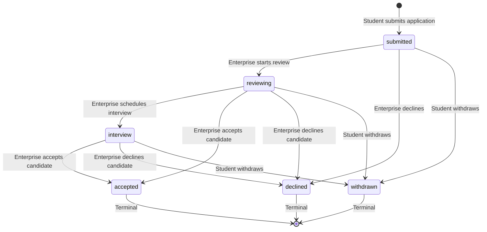

# Phase 7: Enterprise Opportunity and Application Lifecycle Design

- **Date:** 2026-08-22
- **Author:** Antigravity (Phase 7 Basic Preflight)
- **Status:** APPROVED_FOR_CODEX_IMPLEMENTATION
- **Target Branch:** `feature/student`

---

## 1. Architectural Overview

Phase 7 establishes the canonical lifecycle for enterprise internship opportunities and student job/internship applications across TalentHub. It provides a single source of truth connecting Enterprise recruitment management and Student career opportunity application flows.

### Key Goals & Non-Goals

- **Goals:**
  - Create canonical tables: `internship_posts`, `internship_applications`, `application_status_history`, and `application_profile_snapshots`.
  - Ensure Student and Enterprise roles observe the exact same canonical application state and status history.
  - Implement immutable, allow-listed, one-to-one passport snapshots captured at application time, linked to verified privacy consents.
  - Ensure Enterprise users can only view and manage posts and applications belonging strictly to their authenticated enterprise (`enterprise_members` mapping).
  - Enforce atomic transactions for create, withdraw, and review commands.
- **Non-Goals (Deferred to Phase 8):**
  - Notification table/service/APIs are strictly deferred to Phase 8.
  - Phase 7 does not create notification interfaces, producers, no-op adapters, tables, APIs, or UI. Phase 8 will integrate application lifecycle events after the Phase 7 transactions are stable.

---

## 2. Role Ownership & Permission Architecture

TalentHub uses strict server-side RBAC and membership verification. No client-supplied enterprise or user identifiers are trusted.

### 2.1 Identity Resolution Matrix

| Role | Session Resolution Rule | Mutation Scope | Read Scope |
|---|---|---|---|
| **Student** | `$_SESSION['user']['id']` &rarr; `student_profiles.id` | Own applications only (`create_own`, `withdraw_own`) | Available active posts (`read_available`), own applications & history (`read_own`) |
| **Enterprise** | `$_SESSION['user']['id']` &rarr; `enterprise_members.enterpriseId` &rarr; `enterprises.id` | Own posts & applications to own posts | Own posts, applications to own posts, consented applicant passport snapshots |
| **Teacher** | `$_SESSION['user']['id']` &rarr; `teacher_profiles.id` | None (Phase 7 has no Teacher mutation) | None (or general catalog if authorized) |
| **School** | `$_SESSION['user']['id']` &rarr; `school_members.schoolId` | None (Phase 7 has no School mutation) | None |

### 2.2 Reused RBAC Permissions

All permissions are already provisioned and seeded in `permissions` and `role_permissions`:

- **Student:**
  - `internship_post.read_available`: Read published/active internship posts where `deadline >= NOW()`.
  - `internship_application.create_own`: Submit new application with passport snapshot and consent.
  - `internship_application.read_own`: Read student's own submitted applications and status history.
  - `internship_application.withdraw_own`: Transition eligible own application to `withdrawn`.
- **Enterprise:**
  - `internship_post.read_own_business`: View posts created by own enterprise.
  - `internship_post.create_own_business`: Create new internship post for own enterprise.
  - `internship_post.update_own_business`: Edit own enterprise internship post.
  - `internship_post.publish_own_business`: Publish draft post (`draft` &rarr; `active`).
  - `internship_post.close_own_business`: Close active post (`active` &rarr; `closed`).
  - `internship_application.read_own_business`: Read applications received for own posts.
  - `internship_application.review_own_business`: Transition application status & add reviewer notes.
  - `internship_application.read_cv_own_business`: Read consented candidate snapshot and resume details.
  - `talent.read_consented`: Access consented student profile data.

---

## 3. Runtime vs Target Schema Specification

The target migration `Database/migrations/20260821000500_create_internships_and_application_lifecycle.php` introduces 4 tables in `talenthub_local`:

### 3.1 `internship_posts`

| Column | Type | Nullable | Default | Constraints / Notes |
|---|---|---|---|---|
| `id` | `CHAR(36)` | NO | None | Primary Key (UUIDv4) |
| `enterpriseId` | `CHAR(36)` | NO | None | FK &rarr; `enterprises(id)` ON DELETE RESTRICT ON UPDATE CASCADE |
| `title` | `VARCHAR(255)` | NO | None | Post job title |
| `field` | `VARCHAR(150)` | NO | None | Industry/discipline (e.g. IT, Marketing) |
| `status` | `VARCHAR(50)` | NO | `'draft'` | CHECK `status IN ('draft', 'active', 'closed', 'cancelled')` |
| `workType` | `VARCHAR(100)` | NO | `'full_time'` | Work arrangement (Full-time, Part-time, Remote, Hybrid) |
| `duration` | `VARCHAR(100)` | NO | None | Expected internship duration (e.g. '3 months') |
| `educationLevel` | `VARCHAR(100)` | NO | None | Target education level |
| `location` | `VARCHAR(255)` | NO | None | Physical location / office city |
| `slots` | `INT UNSIGNED` | NO | `1` | Number of openings |
| `deadline` | `DATETIME(6)` | NO | None | Application deadline in UTC |
| `description` | `TEXT` | NO | None | Full job description |
| `skillsJson` | `JSON` | NO | None | CHECK `JSON_VALID(skillsJson)` (Required skills array) |
| `requirementsJson` | `JSON` | YES | `NULL` | Optional requirements array |
| `benefits` | `TEXT` | YES | `NULL` | Compensation and perks |
| `createdAt` | `DATETIME(6)` | NO | `CURRENT_TIMESTAMP(6)` | Creation timestamp UTC |
| `updatedAt` | `DATETIME(6)` | NO | `CURRENT_TIMESTAMP(6)` | `ON UPDATE CURRENT_TIMESTAMP(6)` |

**Indexes & Constraints:**
- `PRIMARY KEY (id)`
- `KEY idx_internship_posts_enterprise (enterpriseId)`
- `KEY idx_internship_posts_status_deadline (status, deadline)`
- `CONSTRAINT fk_internship_posts_enterprise FOREIGN KEY (enterpriseId) REFERENCES enterprises(id) ON DELETE RESTRICT ON UPDATE CASCADE`
- `CONSTRAINT chk_internship_posts_status CHECK (status IN ('draft', 'active', 'closed', 'cancelled'))`
- `CONSTRAINT chk_internship_posts_skills_json CHECK (JSON_VALID(skillsJson))`

---

### 3.2 `internship_applications`

| Column | Type | Nullable | Default | Constraints / Notes |
|---|---|---|---|---|
| `id` | `CHAR(36)` | NO | None | Primary Key (UUIDv4) |
| `postId` | `CHAR(36)` | NO | None | FK &rarr; `internship_posts(id)` ON DELETE RESTRICT ON UPDATE CASCADE |
| `studentId` | `CHAR(36)` | NO | None | FK &rarr; `student_profiles(id)` ON DELETE RESTRICT ON UPDATE CASCADE |
| `status` | `VARCHAR(50)` | NO | `'submitted'` | CHECK `status IN ('submitted', 'reviewing', 'interview', 'accepted', 'declined', 'withdrawn')` |
| `appliedAt` | `DATETIME(6)` | NO | `CURRENT_TIMESTAMP(6)` | Application submission timestamp |
| `message` | `VARCHAR(500)` | YES | `NULL` | Candidate cover note |
| `reviewerNote` | `TEXT` | YES | `NULL` | Internal Enterprise review notes |
| `reviewedAt` | `DATETIME(6)` | YES | `NULL` | Last review timestamp |
| `reviewedBy` | `CHAR(36)` | YES | `NULL` | FK &rarr; `users(id)` ON DELETE SET NULL ON UPDATE CASCADE |
| `createdAt` | `DATETIME(6)` | NO | `CURRENT_TIMESTAMP(6)` | Record creation UTC |
| `updatedAt` | `DATETIME(6)` | NO | `CURRENT_TIMESTAMP(6)` | `ON UPDATE CURRENT_TIMESTAMP(6)` |

**Indexes & Constraints:**
- `PRIMARY KEY (id)`
- `UNIQUE KEY uq_internship_applications_post_student (postId, studentId)` (Duplicate prevention barrier)
- `KEY idx_internship_applications_student (studentId)`
- `KEY idx_internship_applications_post_status (postId, status)`
- `KEY idx_internship_applications_reviewed_by (reviewedBy)`
- `CONSTRAINT fk_internship_applications_post FOREIGN KEY (postId) REFERENCES internship_posts(id) ON DELETE RESTRICT ON UPDATE CASCADE`
- `CONSTRAINT fk_internship_applications_student FOREIGN KEY (studentId) REFERENCES student_profiles(id) ON DELETE RESTRICT ON UPDATE CASCADE`
- `CONSTRAINT fk_internship_applications_reviewer FOREIGN KEY (reviewedBy) REFERENCES users(id) ON DELETE SET NULL ON UPDATE CASCADE`
- `CONSTRAINT chk_internship_applications_status CHECK (status IN ('submitted', 'reviewing', 'interview', 'accepted', 'declined', 'withdrawn'))`

---

### 3.3 `application_status_history`

| Column | Type | Nullable | Default | Constraints / Notes |
|---|---|---|---|---|
| `id` | `CHAR(36)` | NO | None | Primary Key (UUIDv4) |
| `applicationId` | `CHAR(36)` | NO | None | FK &rarr; `internship_applications(id)` ON DELETE RESTRICT ON UPDATE CASCADE; prevents hard deletion from erasing audit history |
| `fromStatus` | `VARCHAR(50)` | YES | `NULL` | Prior status (`NULL` on initial submission) |
| `toStatus` | `VARCHAR(50)` | NO | None | New status |
| `changedByUserId`| `CHAR(36)` | NO | None | FK &rarr; `users(id)` ON DELETE RESTRICT ON UPDATE CASCADE |
| `changedByRole` | `VARCHAR(50)` | NO | None | Role name (`'student'`, `'enterprise'`, `'system'`) |
| `note` | `TEXT` | YES | `NULL` | Reason or comment for status transition |
| `createdAt` | `DATETIME(6)` | NO | `CURRENT_TIMESTAMP(6)` | Transition timestamp UTC |

**Indexes & Constraints:**
- `PRIMARY KEY (id)`
- `KEY idx_application_status_history_application (applicationId, createdAt)`
- `KEY idx_application_status_history_changed_by (changedByUserId)`
- `CONSTRAINT fk_application_status_history_application FOREIGN KEY (applicationId) REFERENCES internship_applications(id) ON DELETE RESTRICT ON UPDATE CASCADE`
- `CONSTRAINT fk_application_status_history_user FOREIGN KEY (changedByUserId) REFERENCES users(id) ON DELETE RESTRICT ON UPDATE CASCADE`

---

### 3.4 `application_profile_snapshots`

| Column | Type | Nullable | Default | Constraints / Notes |
|---|---|---|---|---|
| `id` | `CHAR(36)` | NO | None | Primary Key (UUIDv4) |
| `applicationId` | `CHAR(36)` | NO | None | Unique FK &rarr; `internship_applications(id)` ON DELETE RESTRICT; snapshot survives as a deletion barrier |
| `consentId` | `CHAR(36)` | NO | None | FK &rarr; `privacy_consents(id)` ON DELETE RESTRICT |
| `schemaVersion` | `VARCHAR(50)` | NO | `'1.0.0'` | Version of the snapshot payload format |
| `snapshotPayload`| `JSON` | NO | None | Minimized allow-listed JSON talent passport |
| `createdAt` | `DATETIME(6)` | NO | `CURRENT_TIMESTAMP(6)` | Capture timestamp UTC |

**Indexes & Constraints:**
- `PRIMARY KEY (id)`
- `UNIQUE KEY uq_application_profile_snapshots_application (applicationId)` (One-to-one with application)
- `KEY idx_application_profile_snapshots_consent (consentId)`
- `CONSTRAINT fk_application_profile_snapshots_application FOREIGN KEY (applicationId) REFERENCES internship_applications(id) ON DELETE RESTRICT ON UPDATE CASCADE`
- `CONSTRAINT fk_application_profile_snapshots_consent FOREIGN KEY (consentId) REFERENCES privacy_consents(id) ON DELETE RESTRICT ON UPDATE CASCADE`
- `CONSTRAINT chk_application_profile_snapshots_payload CHECK (JSON_VALID(snapshotPayload))`

---

## 4. Status Machine and State Transition Matrix

### 4.1 Post Status Lifecycle
- `draft`: Post being created by Enterprise. Not visible to Students.
- `active`: Published and accepting applications (provided `deadline >= NOW()`).
- `closed`: Application deadline reached or closed manually by Enterprise. Visible for history, no new applications.
- `cancelled`: Cancelled by Enterprise. Terminal state.

### 4.2 Application Status Transition Matrix



| Current Status | Next Status | Triggering Role | Allowed? | History Recorded? |
|---|---|---|:---:|:---:|
| `(initial)` | `submitted` | Student | Yes | Yes (`fromStatus = NULL`) |
| `submitted` | `reviewing` | Enterprise | Yes | Yes |
| `submitted` | `declined` | Enterprise | Yes | Yes |
| `submitted` | `withdrawn` | Student | Yes | Yes |
| `reviewing` | `interview` | Enterprise | Yes | Yes |
| `reviewing` | `accepted` | Enterprise | Yes | Yes |
| `reviewing` | `declined` | Enterprise | Yes | Yes |
| `reviewing` | `withdrawn` | Student | Yes | Yes |
| `interview` | `accepted` | Enterprise | Yes | Yes |
| `interview` | `declined` | Enterprise | Yes | Yes |
| `interview` | `withdrawn` | Student | Yes | Yes |
| `accepted` | Any | Any | **No** (Terminal) | - |
| `declined` | Any | Any | **No** (Terminal) | - |
| `withdrawn` | Any | Any | **No** (Terminal) | - |

**Withdrawal Invariants:**
- Student can only withdraw if application status is in `['submitted', 'reviewing', 'interview']`.
- Once `accepted` or `declined`, student cannot withdraw.
- Withdrawal is recorded via status update and history append; the application and snapshot rows are **never deleted**.

---

## 5. Transaction Designs

### 5.1 Student Create Application Transaction
1. **Authentication & Session:** Resolve `userId` from authenticated session &rarr; verify `Student` role &rarr; query `student_profiles.id`.
2. **Post Validation:** Query `internship_posts` with `WHERE id = :postId AND status = 'active' AND deadline >= NOW(6) FOR UPDATE` (or read check within transaction). If missing, closed, or expired, reject with `422 OPPORTUNITY_NOT_AVAILABLE`.
3. **Consent Check:** Lock and verify an existing active `privacy_consents` row with `studentId = :studentId`, `scope = 'application_profile_share'`, `isGranted = 1`, `grantedAt IS NOT NULL`, and `revokedAt IS NULL`. Application submission must never silently grant consent. If no active row exists, reject without inserting an application, snapshot, or history row. Any consent grant/renewal must be a separate, explicit learner-confirmed command protected by `privacy_consent.manage_own` before submission is retried.
4. **Duplicate Prevention:** Query `internship_applications WHERE postId = :postId AND studentId = :studentId FOR UPDATE`. If found, throw `409 DUPLICATE_APPLICATION`. (The `uq_internship_applications_post_student` constraint acts as database barrier).
5. **Snapshot Construction:** Fetch student's profile details (`student_profile_details`), skills (`student_skills` join `skills`), verified certificates (`certificates`), projects (`projects`), and verified experience hours (`experience_logs`). Assemble the strict allow-listed JSON payload.
6. **Generate IDs:** Generate UUIDv4 for `applicationId`, `snapshotId`, `historyId`.
7. **Insert Application:** `INSERT INTO internship_applications (id, postId, studentId, status, appliedAt, message, createdAt, updatedAt) VALUES (:applicationId, :postId, :studentId, 'submitted', NOW(6), :message, NOW(6), NOW(6))`.
8. **Insert Snapshot:** `INSERT INTO application_profile_snapshots (id, applicationId, consentId, schemaVersion, snapshotPayload, createdAt) VALUES (:snapshotId, :applicationId, :consentId, '1.0.0', :payloadJson, NOW(6))`.
9. **Insert History:** `INSERT INTO application_status_history (id, applicationId, fromStatus, toStatus, changedByUserId, changedByRole, note, createdAt) VALUES (:historyId, :applicationId, NULL, 'submitted', :userId, 'student', 'Ứng tuyển cơ hội', NOW(6))`.
10. **Commit:** Commit transaction. If any step fails, roll back entire transaction.

### 5.2 Student Withdraw Application Transaction
1. **Authentication:** Resolve `studentId` from authenticated student session.
2. **Lock Application:** `SELECT id, postId, studentId, status FROM internship_applications WHERE id = :applicationId AND studentId = :studentId FOR UPDATE`.
3. **State Guard:** Assert `status IN ('submitted', 'reviewing', 'interview')`. If terminal (`accepted`, `declined`, `withdrawn`), reject with `422 ILLEGAL_STATUS_TRANSITION`.
4. **Update Status:** `UPDATE internship_applications SET status = 'withdrawn', updatedAt = NOW(6) WHERE id = :applicationId`.
5. **Append History:** `INSERT INTO application_status_history (id, applicationId, fromStatus, toStatus, changedByUserId, changedByRole, note, createdAt) VALUES (:historyId, :applicationId, :currentStatus, 'withdrawn', :userId, 'student', :withdrawReason, NOW(6))`.
6. **Commit:** Commit transaction.

### 5.3 Enterprise Review Application Transaction
1. **Authentication & Ownership:** Resolve `userId` from session &rarr; lookup `enterpriseId` from `enterprise_members WHERE userId = :userId`. Reject with `403` if user does not belong to an enterprise.
2. **Lock Application with Post Join:**
   ```sql
   SELECT ia.id, ia.postId, ia.status, ip.enterpriseId
   FROM internship_applications ia
   JOIN internship_posts ip ON ip.id = ia.postId
   WHERE ia.id = :applicationId AND ip.enterpriseId = :enterpriseId
   FOR UPDATE;
   ```
   If row is not found, return `404 APPLICATION_NOT_FOUND` (prevents leaking existence of applications belonging to other enterprises).
3. **Optimistic Locking Guard:** Validate `expectedCurrentStatus === ia.status`. If mismatch, reject with `409 CONCURRENT_MODIFICATION`.
4. **Transition Validation:** Check that `ia.status &rarr; targetStatus` is allowed in the state transition matrix.
5. **Update Application:**
   ```sql
   UPDATE internship_applications
   SET status = :targetStatus,
       reviewerNote = :reviewerNote,
       reviewedAt = NOW(6),
       reviewedBy = :userId,
       updatedAt = NOW(6)
   WHERE id = :applicationId;
   ```
6. **Append History:**
   ```sql
   INSERT INTO application_status_history
   (id, applicationId, fromStatus, toStatus, changedByUserId, changedByRole, note, createdAt)
   VALUES
   (:historyId, :applicationId, :currentStatus, :targetStatus, :userId, 'enterprise', :reviewerNote, NOW(6));
   ```
7. **Commit:** Commit transaction.

---

## 6. Application Profile Snapshot Allow-List Schema

Snapshot data is captured once at submission and is strictly immutable. Subsequent edits to `student_profiles`, `student_skills`, or revoked consents will not alter existing snapshot records.

### Allow-List JSON Format (`schemaVersion = '1.0.0'`)

```json
{
  "schemaVersion": "1.0.0",
  "capturedAt": "2026-08-22T14:30:00.000000Z",
  "consentId": "30000000-0000-4000-8000-000000000001",
  "student": {
    "studentProfileId": "10000000-0000-4000-8000-000000000021",
    "fullName": "Nguyễn Văn An",
    "email": "student@talenthub.local",
    "phone": "0912345678",
    "dateOfBirth": "2003-05-15",
    "studyStatus": "active",
    "className": "ĐTVT01 - K63",
    "schoolName": "Đại học Bách Khoa Hà Nội",
    "headline": "Sinh viên năm 4 đam mê Frontend & UI Engineering",
    "location": "Hà Nội",
    "bio": "Em có 2 năm kinh nghiệm thực chiến với React...",
    "avatarUrl": null
  },
  "skills": [
    { "skillName": "React", "level": "advanced", "category": "technical" },
    { "skillName": "TypeScript", "level": "intermediate", "category": "technical" }
  ],
  "certificates": [
    {
      "certificateId": "40000000-0000-4000-8000-000000000001",
      "name": "AWS Certified Cloud Practitioner",
      "issuingOrganization": "Amazon Web Services",
      "issueDate": "2025-12-01",
      "credentialUrl": "https://aws.amazon.com/verify/123"
    }
  ],
  "projects": [
    {
      "projectId": "50000000-0000-4000-8000-000000000001",
      "title": "E-Commerce Web Application",
      "category": "technical",
      "role": "Frontend Lead",
      "summary": "Phát triển frontend với React và Redux Toolkit...",
      "link": "https://github.com/example/ecommerce"
    }
  ],
  "experience": {
    "totalConfirmedHours": 120,
    "totalActivitiesAttended": 5
  }
}
```

### Prohibited / Redacted Attributes:
- No passwords, auth tokens, session IDs, or password reset tokens.
- No assessment raw answer payloads or psychological question choices.
- No internal administrative review logs or unconsented private records.
- No arbitrary file paths or unchecked external URLs.

---

## 7. Security & CV/Snapshot Access Control

1. **CV / Snapshot Read Authorization:**
   - Student can read their own snapshot via `GET /app/learner/api/v1/applications.php?id=:applicationId`.
   - Enterprise can read snapshot via `GET /app/enterprise/internships/applicants.php?postId=:postId&applicantId=:applicationId` only if `postId` belongs to `enterpriseId`.
   - No direct URL-based access to arbitrary snapshots without checking ownership.
2. **Anti-Leak 404 Behavior:**
   - Any request by Enterprise A for applications or snapshots belonging to Enterprise B MUST return `404 Not Found`, identical to non-existent resources.

---

## 8. Notification Deferral to Phase 8

Phase 7 creates no notification interface, producer, adapter, placeholder, table,
API, or UI. Phase 7 transactions commit only their canonical application,
snapshot, and history rows. Phase 8 will add its own producer contract and publish
application events only after the corresponding Phase 7 domain transaction has
succeeded, without requiring speculative Phase 7 code.
